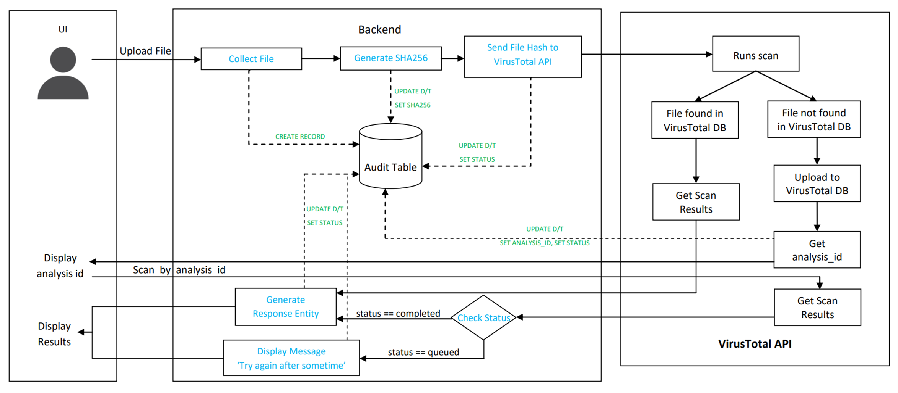

# File Scanner Application

Springboot based Application that lets users upload files, forwards those files to an *3rd party API for malware analysis*, and then returns a simple scan results to the user.To track the progess of files that are reveived an *Audit Tabel* is implemented.

## ARCHITECTURE

### Scanning using SHA256

When User uploads a file to the server intial phase of scanning happens using the hex code (_hex code is like a finger print for a digital file any silght change in contents of the files changes the hex code*)

- File name, File type and Contents of the file are read and file is passed to Scanning using HEX code.
- In Hex code geration(SHA256) Multipartfile is converted into a file and SHA256 is genrated using the file *as byte Source*.The HEX code thus generated is passed to VirusTotal (3rd Party API).
- If the HEX code is present is Virus Total database. Virus Total results in a detailed response consisting of Other Hashes of the File like MD5, previous submision time and response form differnt anti-virus vendors.Out of the all these feilds *"last_analysis_stats"* is sufficient to decide Malicious status of the file.  
- After receiving the response from VirusTotal, exctrating the required filed and finalising a verdict based on these stats take place.

### Uploading file to Virus Total data base

In most of the cases there is significant chance that the file uploaded by the user is not present in VirusTotal DataBase(SHA256 is not present in virus Total Database). In such case file is uploaded to VirusTotal data base and an analysis Id is expected as a response,Which will be used to fetch the scan results of the uploaded file in later point of time.

### Fetching Scan Results using Analysis ID

Posting a request using Virus total api end point always results in a response that contains *stats* and *status* fields the status filed signifies the Scan status i.e. Completed/Queued. The Verdit is finalized using Stats only if the *"Status"* is "*completed*" else a message requesting the user to try again is displayed.

## SCHEMA

### AUDIT TABLE

| FIELD NAME    | DATA TYPE | CONTEXT                                                                 |
| :-------- | :-------: |-------------------------------------------------------------------------|
| ID   | BIG INT    | Primary Key                                                             |
| SHA256 | VAR CHAR     | Updates the SHA256 when hex code is generated.                          |
| ANALYSIS ID    | VAR CHAR    | Updates the Analysis id when received from VirusTotal end point.        |
| FILE NAME | VAR CHAR | Contains the file name.                                                 |
|LAST UPDATE TIME| TIME STAMP| Stores the Date ane time of th last update in *YYYY-MM-DD HH:MM* fromat |
|SCAN RESULTS|VAR CHAR| Updates the Malicious status of the file after scanning.                |
|STATUS | VAR CHAR| A correspoinding Stiring that signifies the progess of the file.        |

- STATUS:
  - File uploaded to Server
  - Scanning Using Hex
  - Uploaded to VT DB
  - Scanning using Analysis Id
  - Queued at VirusTotal
  - Scanning completed (using SHA256)
  - Scanning completed (unsing Analysi Id)

## Mentors
- [Anand premi]
- [Prabhakar Radhakrishna]
  
  ## Team Members
  - [Nirbhai Sai K](https://github.com/NIRBHAI-SAI)
  - [Keerthana S](https://github.com/keerthanaS10)
  - [Nimitha Reddy M](https://github.com/nimithareddy03)
  - [Kishore Kumar B](https://github.com/kishor1010)
  - [Mohammad Affan S](https://github.com/ROckx14)
  